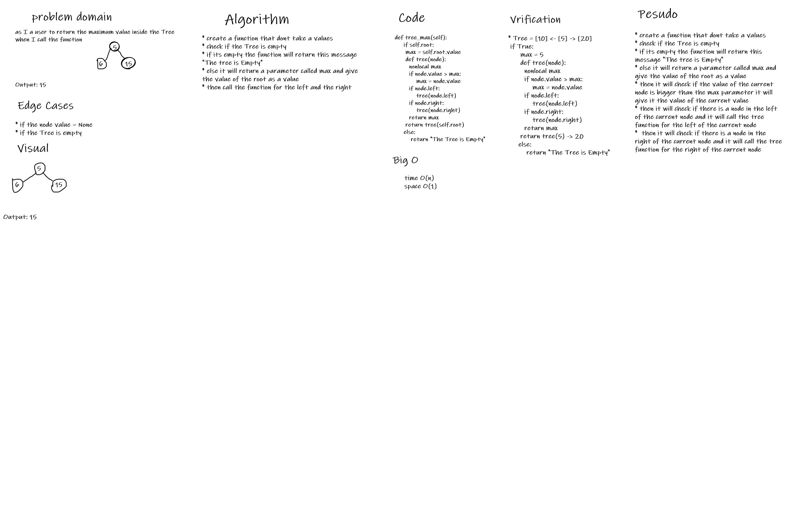

# Trees
its a group of nodes that have a root and the nodes that are in the left to the root are less than the root and the nodes that are in the right of the root are more than the root

## Challenge
* to declare class Binary_Tree that contain 3 functions (pre_order,in_order,post_order)
* to declare class binary_search_tree that is subclass from binary_tree and it have 2 functions (add,contains)

## Approach & Efficiency
Time : O(n)
space : O(1)

## API
* add function: it will check if the root is empty it will add the new value to the root else it will check if the new value is more or less than the root if less it will start the same operation from the left node and if more it will do the same operation from the right node
* pre-order function: it will take the value of the current node the move to the left and then to the right
* in-order function: it will take the value of the left of the current node then the value of the current node then the right of the current node and its return the values in Ascending order
* post-order function: it will take the value of the left of the current node then the right of the current node then the value of the current node

# Tree max
to write a function that return the maximum value inside the Tree

## Whiteboard Process

## Approach & Efficiency
Time : O(n)
space : O(1)

## Solution
to write a function inside the main function and call it for all the nodes inside the Tree then return the max value
