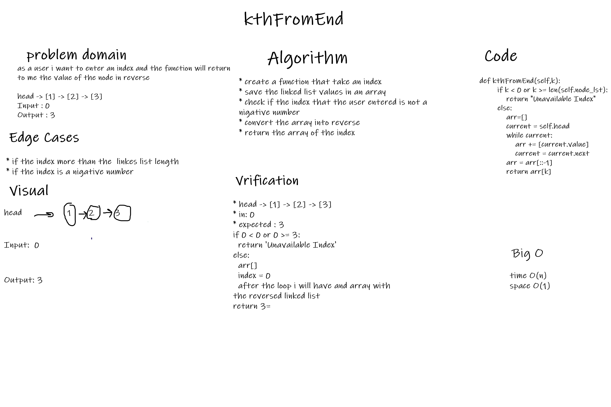

# Challenge 7

## Challenge Summary
* to create a function kthFromEnd(index) that return the value of the node in reverse

## Whiteboard Process

## Approach & Efficiency
time: O(n)
space: O(1)

## Solution
to convert the linked list to and array and get the reverse of the array and return the array of the index that the user entered

# Challenge 6
## Challenge
* to create three functions (append,insert_after,insert_before)

## whiteboard process
### Append

### Insert Before

### Insert After

## Approach & Efficiency
* append: time: O(n) space: O(1)
* insert_after: time: O(n) space: O(1)
* insert_before: time: O(n) space: O(1)

## solution 
* append: to add a new node to the end of the linked list
* insert_after: to add a new node after the chosen node
* insert_before: to add a new node before the chosen node
 

# Challenge 5
## Singly Linked List
The linked list is alternative to an array-based structure. A linked list is collection of nodes that collectively form linear sequence. In a singly linked list, each node stores a reference to an object that is an element of the sequence, as well as a reference to the next node of the list. It does not store any pointer or reference to the previous node. To store a single linked list, only the reference or pointer to the first node in that list must be stored. The last node in a single linked list points to nothing.

## Challenge
Create a Node class that has properties for the value stored in the Node, and a pointer to the next Node. Within your LinkedList class, include a head property. Upon instantiation, an empty Linked List should be created. Create methods in the LinkedList class that can insert, check for inclusion, and list nodes.

## Approach & Efficiency
space --> O(n)
time --> O(n)

## API
append function , which takes any value as an argument and adds a new node with that value to the end of the list with an O(n) Time performance.

insert function , which takes any value as an argument and add a node of a value to the head of LL with an O(1) Time performance.

includes function , which takes any value as an argument and Return T/F if value is in the linked list or not

str function , which dose not takes an arguments and returns a string representing all the values in the Linked List.
