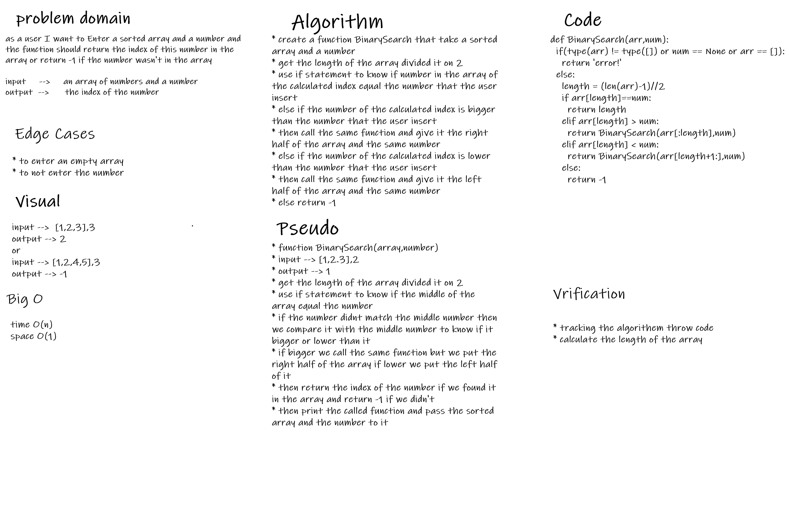

# array binary search
* it a function that take 2 argument the first one is a sorted array and the second one is a number and it will search for the number on it and if it found the number it will return the index of the number and if it didn't it will return -1

## whiteboard process

## Approach & Efficiency
* time O(n)
* space O(1)