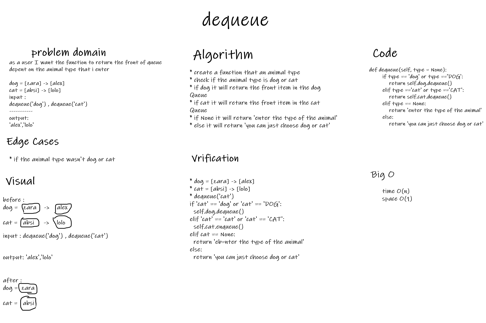
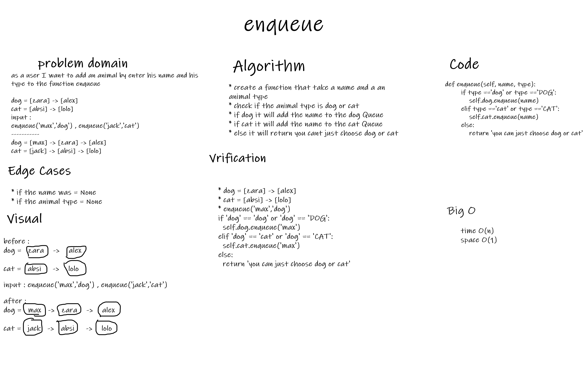

# Challenge Summary
to declare a class called AnimalShelter and  write a dequeue and enqueue functions
## Whiteboard Process
### dequeue

### enqueue

## Approach & Efficiency
### dequeue:
* time: O(n)
* space: O(1)

### enqueue:
* time: O(n)
* space: O(1)

## Solution
### dequeue: to add the new animal to the animal queue that the user choose
### enqueue: to return the front of the queue that the user choose