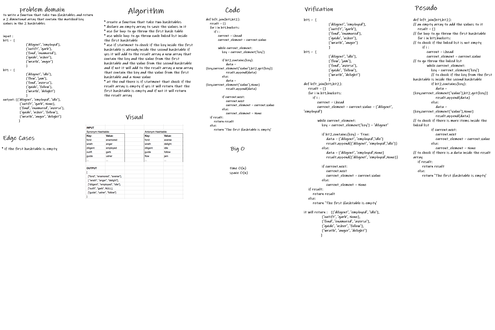

# Hashmap LEFT JOIN
to write a function that take two Hashtables and return a 2 dimintional array that contain the matched key values in the 2 hashtables

## Challenge
* to go throw the hashtables
* to add the arrays of data to the result array

## Approach & Efficiency
Time: O(n)
Space: O(n)

## Solution
* declare an empty array to save the values in it
* use for loop to go throw the first hash table
* use while loop to go throw each linked list inside the first hashtable
* use if statment to check if the key inside the first hashtable is already inside the second hashtable if yes it will add to the result array a new array that contain the key and the value from the first hashtable and the value from the second hashtable and if not it will add to the result array a new array that contain the key and the value from the first hashtable and a None value
* at the end there is if statment that check if the result array is empty if yes it will return that the first hashtable is empty and if not it will return the result array

## Whiteboard
