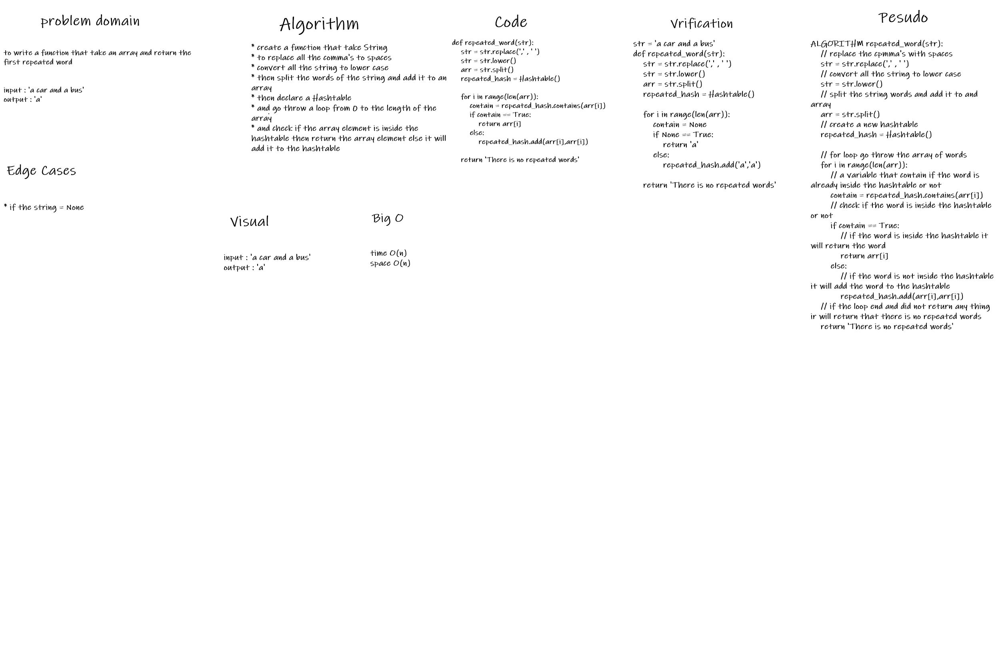

## Challenge: Repeated Word
to write a function that take an array and return the first repeated word

## White-Board

## Approach & Efficiency

- time: O(N)
- space: O(N)

## solution:
* to replace all the comma's to spaces and convert all the string to lower case then split the words of the string and add it to an array the declare a Hashtable and go throw a loop from 0 to the length of the array and check if the array element is inside the hashtable then return the array element else it will add it to the hashtable

