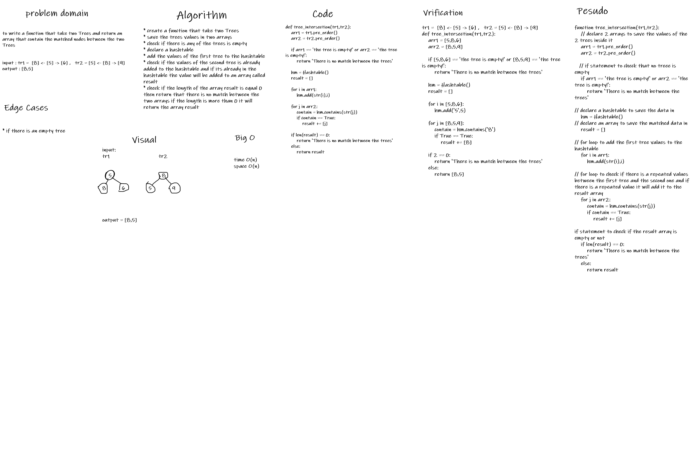

# Challenge Summary: hashmap tree intersection
to create a function that take 2 trees and return an array with the matched values between the 2 trees

## Whiteboard Process

## Approach & Efficiency
Time: O(n)
Space: O(n)

## Solution
* check if there is an empty tree then return that there is match between the trees
* to save the values of the both trees in arrays using the pre-order function 
* then add the first array values to the hashtable
* the check if there are a values from the second array that are already exist in the hashtable
* all the values from the second array that already exist in the hashtable wil be added to a new array called result
* check if the result array is empty then return that there is no match between the 2 trees else it will return the result array