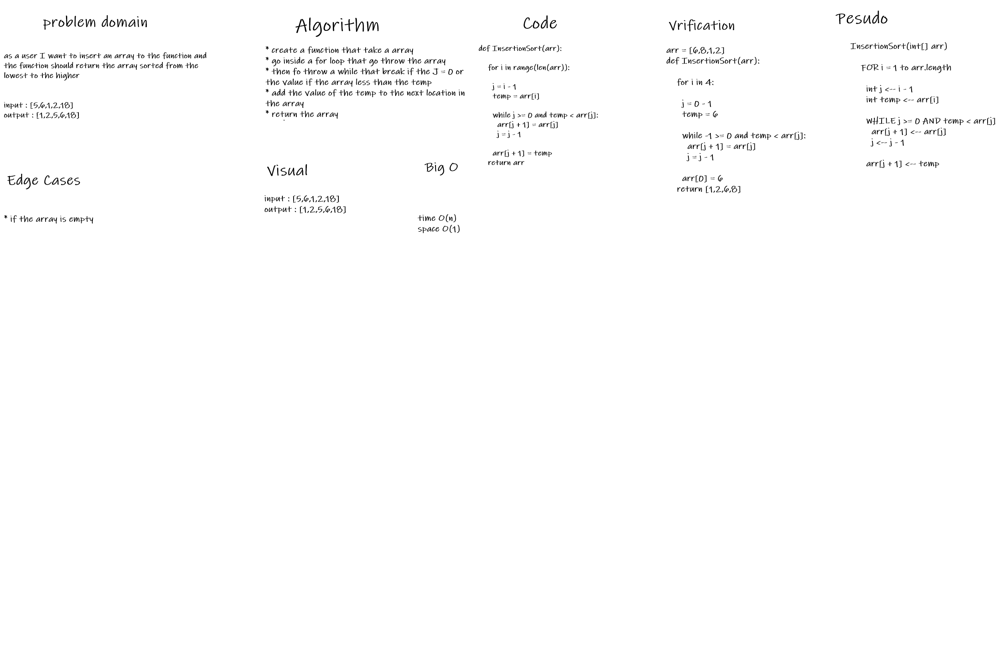

# Code Challenge 26
## Implement insertion sort on a given array.

### Challenge
* Provide a visual step through in [BLOG](blog.md) for each of the sample arrays based on the provided pseudo code
* Convert the pseudo-code into working code in your language
* Present a complete set of working tests

### Big O notation
* time: O(n)
* space: O(n)

### White-Board
