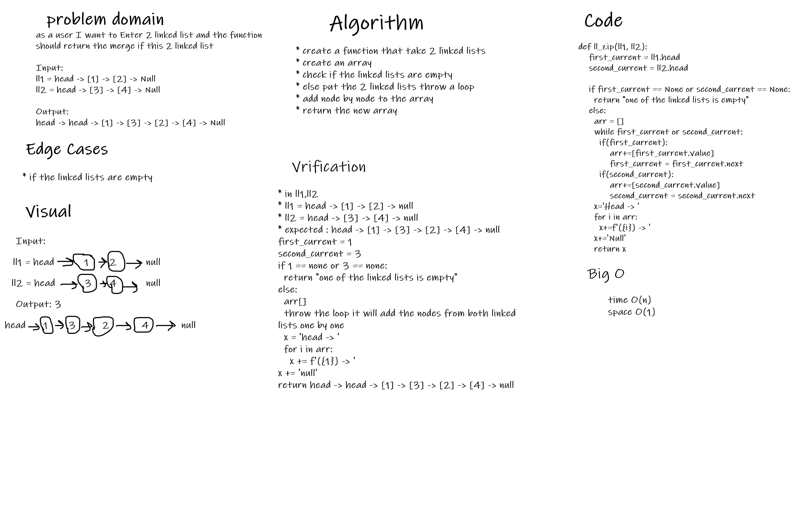

# Challenge Summary
to create a function ll_zip(ll1,ll2) and merge the linked lists

## Whiteboard Process

## Approach & Efficiency
Time: O(n)
Space: O(1)

## Solution
to declare a new array and add the linked lists nodes one by one
