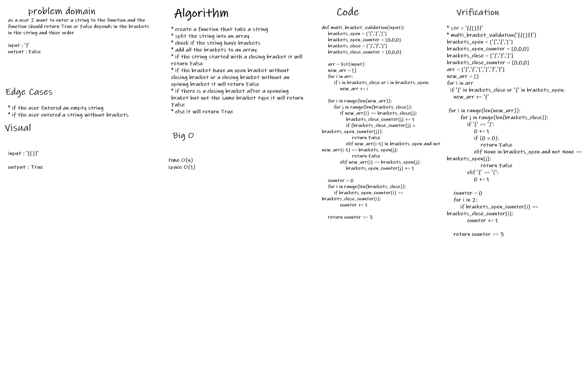

# Challenge Summary
to write a function that take a string and return true if the open and close brackets are equal each other and comes in the order

## Whiteboard Process

## Approach & Efficiency
Time: O(n)
Space: O(1)

## Solution
to split the string and put all the brackets in an array