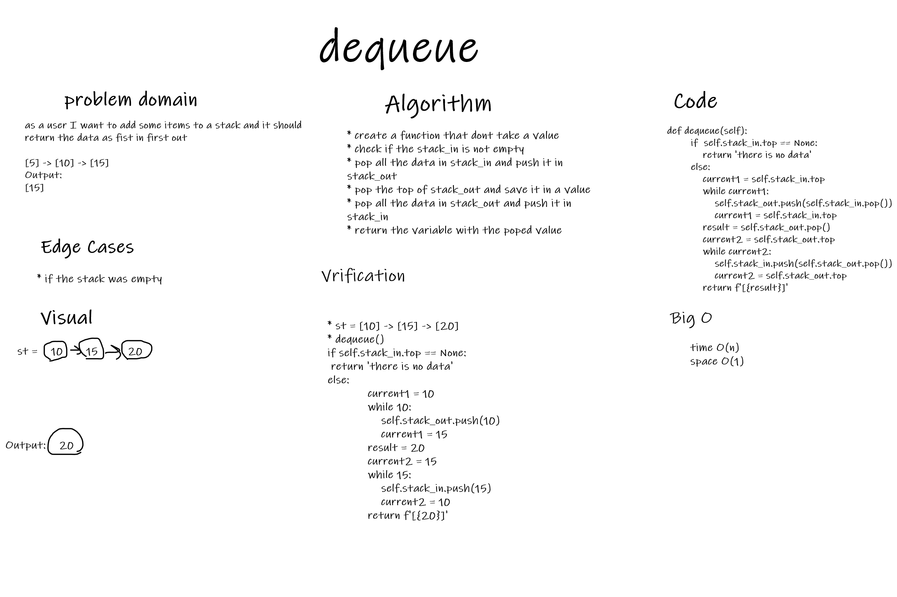

# Challenge Summary
to write a dequeue and enqueue functions
## Whiteboard Process
### dequeue

### enqueue

## Approach & Efficiency
### enqueue:
* time: O(n)
* space: O(1)

### dequeue:
* time: O(n)
* space: O(1)

## Solution
### enqueue: to add the new value to the top of the stack_in
### dequeue: to pop the top if the stack_out