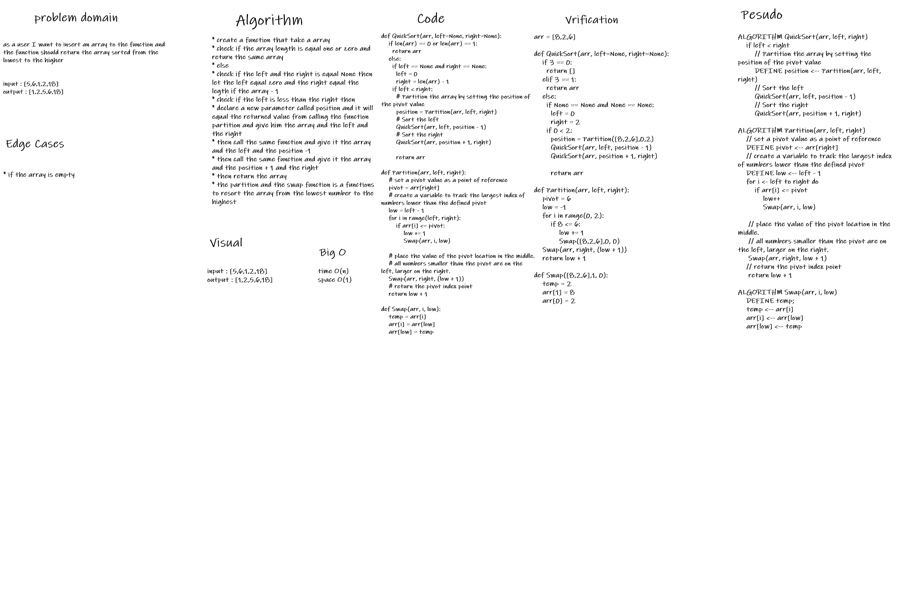

# Code Challenge 28

Implement quick sort on a given array.

Quick sort is similar to merge sort, in that it's a conquer and divide style sorting algorithm. It chooses a pivot value and partitions the input array into a left and right array. The main difference between merge sort and quick sort is that by the time quick sort has broken up the array into sub arrays of single elements the array is sorted.

## Challenge

- Provide a visual step through in [Blog](blog.md) for each of the sample arrays based on the provided pseudo code
- Convert the pseudo-code into working code in your language
- Present a complete set of working tests

## Big O notation

- time <- O(n)
  

- space <- O(n)
  

## White-Board
