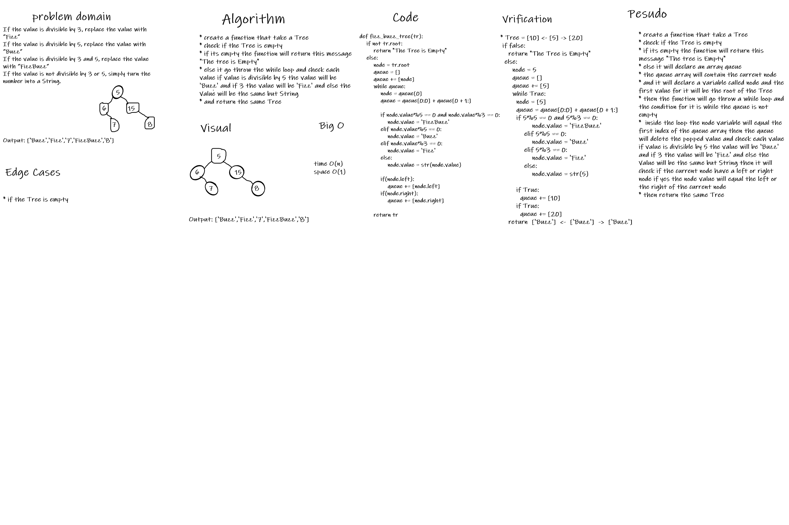

# Tree-fizz-buzz
If the value is divisible by 3, replace the value with “Fizz”
If the value is divisible by 5, replace the value with “Buzz”
If the value is divisible by 3 and 5, replace the value with “FizzBuzz”
If the value is not divisible by 3 or 5, simply turn the number into a String.

## Whiteboard Process

## Approach & Efficiency
Time: O(n)
Space: O(1)

## Solution
to start from the root then take the value of it then take the left and the right values then move to the left of the root and do the same operation the move to the right of the root and do the same operation and so on tell we move to all of the tree nodes then go throw our condition and edit the values According to the conditions